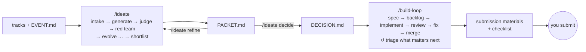

# The harness

Two unattended loops and a design skill, built for solo hackathons. With
implementation cheap, what decides the result is the idea and how finished the
product looks.

## The pieces

| piece | what it is |
|---|---|
| `/ideate` ([skill](../.claude/skills/ideate/SKILL.md), [brief](ideation/README.md)) | Researches the tracks, sponsors, past winners, and what every other team's AI assistant will suggest. Independent generators diverge through different lenses. A cold panel scores the ideas on a demo-first rubric, with capped champion votes. A red team attacks the best ideas, and survivors evolve over up to three rounds. It stops with a decision packet and a notification. |
| `/build-loop` ([skill](../.claude/skills/build-loop/SKILL.md), [brief](build/README.md)) | An orchestrator that never writes code. Planner, implementer, reviewer, fixer, triager and rehearser subagents, each in its own worktree, turn the decision into merged, reviewed PRs. A GitHub-issue backlog, ranked against the demo script and the judging criteria, drives the work. The clock sets the phases: build, then polish, then submit. |
| `ui-craft` ([skill](../.claude/skills/ui-craft/SKILL.md)) | The design direction, the building standards and the review rubric. Every visible change is built and reviewed from screenshots. |
| `review-pr` | A tiered review of a PR, when you want one yourself. |
| `prompt-writing`, `task-guidance` | How the briefs and subagent prompts are written. Tracked here so that cloud sessions have them. |
| `scripts/setup-labels.sh`, `scripts/toutc.mjs` | The build loop's labels and milestones, and its timezone conversion. |

## Running an event

**Once, now: push the harness to `main`**, before any ideation output exists.
Then run `scripts/setup-labels.sh`. The build loop needs `main` as a PR base,
plus its labels and milestones.

1. **Fill in `hackathon/EVENT.md`.** Put the track descriptions in
   `hackathon/tracks/`, or paste them into `/ideate`.
2. **Run `/ideate`.** At the default settings it takes roughly 2.5–3.5 hours.
   Keep the session open and the machine awake. Then read
   `hackathon/ideation/PACKET.md`.
3. **Choose:** `/ideate decide R2-03 your notes`. Or send it back with
   `/ideate refine what you want instead`.
4. **Do the human actions** the decision lists (sign-ups and keys) before the
   start. Keys go in `.env.local` and in GitHub Actions secrets. The app runs on
   fakes until they are there.
5. **Optionally, before the start:** run `/build-loop plan-only`. The spec is
   drafted into `hackathon/draft/` for you to read, and nothing reaches GitHub.
6. **When hacking starts:** start the session in a permission mode that will
   not prompt for `git`, `gh`, the package manager, `node` and the test tools.
   Then run `/build-loop`.
7. **Watch the pinned status issue.** Its first section lists everything
   waiting on you. Answer in comments, remove `needs-decision` or `unsettled`
   to hand work back, and put `hold` on anything you want the loop to leave
   alone. Harness changes wait for your merge.
8. **From the polish phase on**, work through the checklist. It arrives in
   draft when polish starts and is final for the last hour. Record the video
   on the demo-candidate tag, fill in the form, and submit. The loop stops ten
   minutes before the deadline.

## What was borrowed from ClipFarm, and what changed

The build loop adapts ClipFarm's `docs/overnight/`.

**Kept:**

- a brief split by phase, with every rule in exactly one file
- a skill that only starts the loop, with the mode passed in the prompt
- a fixed-interval loop
- cold and semi-cold review rounds, with SHA-stamped markers and review bodies
- terminal labels, each with a reason comment
- the head-freeze and settle-over-green rules
- the evidence rules and the GitHub traps

**Changed, for a solo event measured in hours and run by parallel subagents:**

- **Parallel implementers in separate worktrees**, up to a WIP limit and across
  separate areas. The orchestrator never implements.
- **Every subagent's outcome is recorded on GitHub.** Findings carry IDs.
  Fixers post `fix:` replies. Semi-cold rounds give a verdict on every open
  finding. So routing never depends on what a background agent said in a
  notification.
- **Loop PRs are identified by the `loop` label**, and loop comments by their
  prefixes. The loop and the human share one GitHub account.
- **Settled PRs merge automatically**, one at a time and only over a green
  `main` whose checks have reported on the previous merge. Harness changes are
  the exception and wait for a human. So does anything you comment "wait" on,
  which becomes `hold`.
- **One clean cold round settles a PR**, and the per-PR ceiling is seven
  rounds. The demo-path smoke test and the rehearsals make up for the second
  clean round ClipFarm requires.
- **A clock with phases replaces the round budget.** It is converted to UTC
  with a real timezone library, and it stops everything ten minutes before the
  deadline.
- **The backlog is ranked by value to the demo** and re-triaged as the build
  goes. The planner may gate tickets that implement the spec (`loop-ok`),
  because the human approved the direction in `DECISION.md`.
- **Issue numbers replace card numbers.** ClipFarm's own card numbering had
  collided three times.

## The next event

Clear `hackathon/` as its README describes. Apply any lessons the last event
left in its `docs` cards or in `LESSONS.md`.
